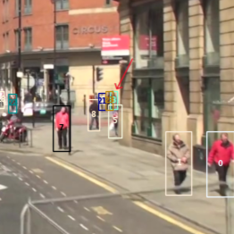

# Multiple Object Tracking for Video Sequences

This project addresses the task of multiple object tracking (MOT), specifically focusing on tracking people walking in video sequences. The base model for detection and tracking is enhanced using advanced techniques to improve performance. The dataset used is MOT16, which contains various scenarios for individual detection.

**Note:** The source code for this project is not included. However, an attached document provides a summary and commentary on the results achieved from the implementation.

## Techniques Implemented

1. **High-Quality Detections**: Only high-probability detections are considered, filtering based on scores.
2. **YOLOv5**: Trained and implemented to identify people in videos, known for its speed and accuracy.
3. **Hungarian Algorithm**: Used for optimal assignment of detections to trajectories.
4. **Trajectory Management**: Counters are used to manage failed detections and false positives, improving the system's robustness.

## Dataset

The [MOT16 dataset](https://motchallenge.net/data/MOT16/) is used for developing and evaluating the tracking algorithms. It consists of 7 training sequences and 7 test sequences, providing diverse scenarios for robust evaluation.

## Performance Metrics

The primary metric for evaluating the model is MOTA (Multiple Object Tracking Accuracy). The improved model achieved an average MOTA of 75.8% on the test data and 68.1% on the full dataset, representing a significant improvement over the base model.

## Methodology

### Object Detection

- **High-Quality Detections**: Implemented in the `object_detector.py` script, ensuring only high-probability detections are considered.
- **YOLOv5 Integration**: Fine-tuned and applied YOLOv5 for detection, although it didn't outperform the Faster R-CNN with ResNet-50 backbone.

### Object Tracking

- **Cost Matrix**: Experimented with a cost matrix based on Euclidean distance but retained the IoU-based matrix for better results.
- **Hungarian Algorithm**: Improved data association by implementing the Hungarian algorithm via the `linear_sum_assignment` method from Scipy.
- **Trajectory Management**: Introduced counters for managing false and missed detections, optimizing the tracking process.

## Results

The enhancements made to the object detection and tracking algorithms resulted in significant improvements in tracking accuracy. Below are the key results obtained from the project:

- **MOTA Improvement**: The final model achieved an average MOTA of 75.8% on the test data and 68.1% on the full dataset.
- **Comparison with Base Model**: The base model had a lower MOTA, and the improvements introduced through better detections and the Hungarian algorithm significantly boosted performance.
- **Qualitative Results**: The tracking visualizations show more stable and accurate trajectories, with fewer identity switches and missed detections.

### Frame 30 of mot10:
#### Base Model Detection

#### Improved Model Detection

### Frame 30 of mot13:

#### Base Model Detection 

#### Improved Model Detection

